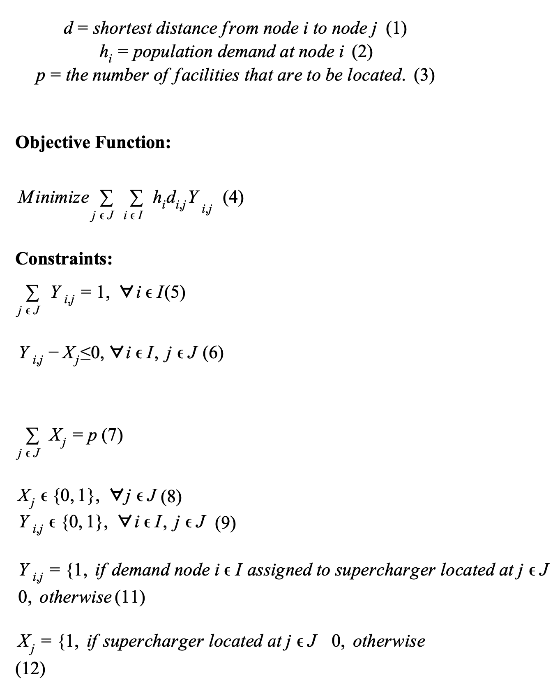
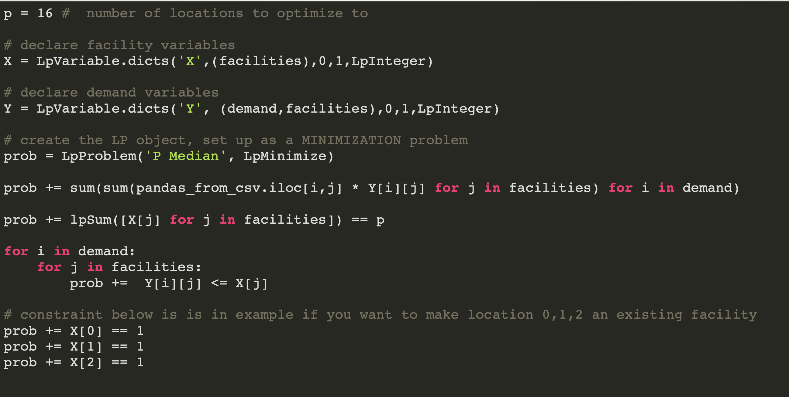
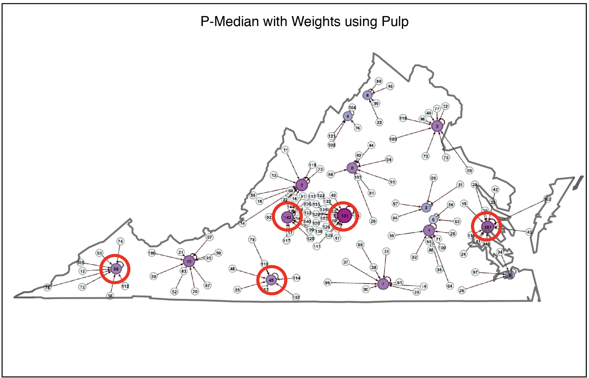
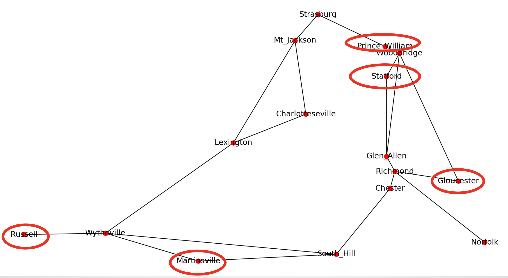

# Pmedian
Solving P-median problem using Python comparing results to ArcGIS Pro

Currently five new Superchargers are proposed for the end of 2018 within Virginia with set locations within counties. This paper will explore how to optimally place these five new Superchargers in comparison to Tesla’s choices based on current fast charging stations, and their distance, and population that the demand needs to meet.

## Goal 1: Can my python program replace the usage of ArcGIS Pro for solving location allocation problems?

Logic Design of Program:

1. Reverse Gecode Tesla Super Chargers 
2. Obtain Mean Centers of Virginia's Counties 
3. Calculate OD Matrix with and without the Population
4. Solve P-Median utilzing Pulp
5. Visualize in NetworkX
6. Export Edge List to visualize in Gephi

### Data:
* Geocoded Tesla Superchargers: Collected the address of the super chargers in VA and reverse gecoded them to obtain the lat/long of them
* US Census 2010 Population data for counties
  * 135 Points, Created Mean Center Points using ArcMap

### P-Median Formulation: 

### OD Matrix Snippet

### P-Median In Python

### Solved Using Python

